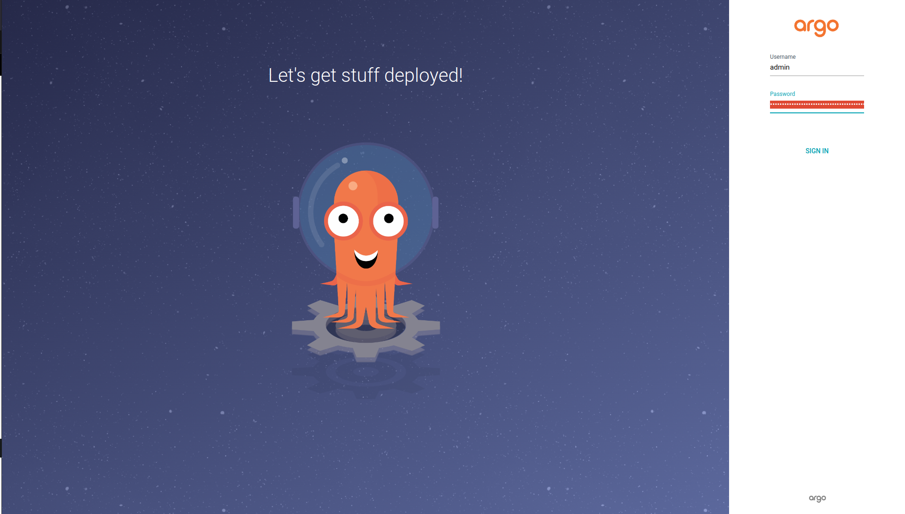
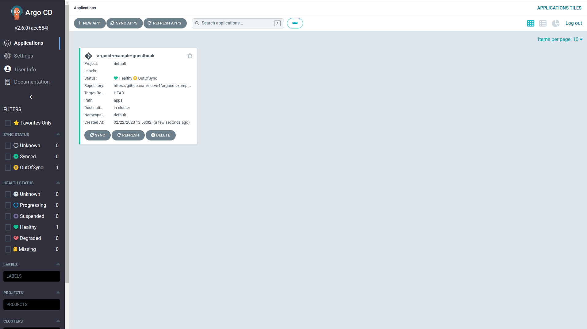
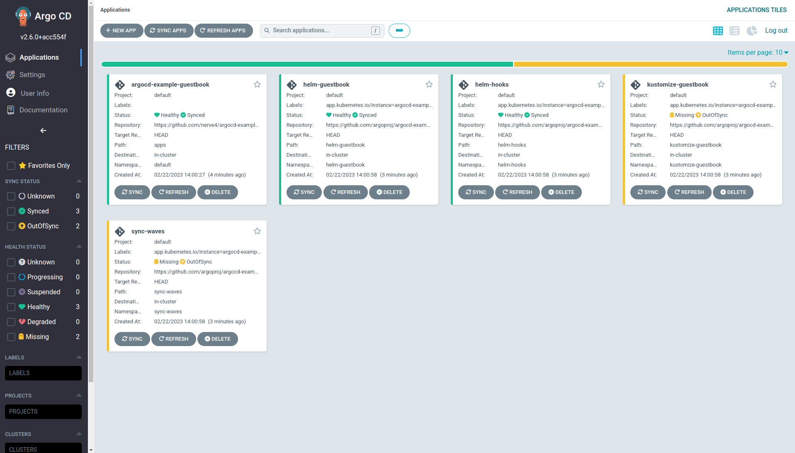

# Demo-argocd

## Summary

Application deployment and lifecycle management should be automated, auditable, and easy to understand so ArgoCD
can be one of the best tool for this.


## ArgoCD Install

Create an `argocd` namespace and install argocd:
```
kubectl create namespace argocd
kubectl apply -n argocd -f https://raw.githubusercontent.com/argoproj/argo-cd/stable/manifests/install.yaml
```

Verify that ArgoCD Pods are running
```
kubectl get pods -n argocd
```
```
NAME                                                READY   STATUS    RESTARTS   AGE
argocd-application-controller-0                     1/1     Running   0          5m39s
argocd-applicationset-controller-69c4b965dc-kj2k8   1/1     Running   0          5m40s
argocd-dex-server-64d856b94c-xm2ct                  1/1     Running   0          5m40s
argocd-notifications-controller-f7c967bc9-bqbdm     1/1     Running   0          5m40s
argocd-redis-598f75bc69-k6548                       1/1     Running   0          5m40s
argocd-repo-server-df7f747b4-2jl6r                  1/1     Running   0          5m40s
argocd-server-59d9b8cb46-5m7gp                      1/1     Running   0          5m40s
```

Verify that the other ArgoCD resources are created
```
kubectl get cm,secret,svc,deploy -n argocd
```
```
NAME                                  DATA   AGE
configmap/argocd-cm                   0      6m22s
configmap/argocd-cmd-params-cm        0      6m22s
configmap/argocd-gpg-keys-cm          0      6m22s
configmap/argocd-notifications-cm     0      6m22s
configmap/argocd-rbac-cm              0      6m22s
configmap/argocd-ssh-known-hosts-cm   1      6m21s
configmap/argocd-tls-certs-cm         0      6m21s
configmap/istio-ca-root-cert          1      14m
configmap/kube-root-ca.crt            1      14m

NAME                                 TYPE     DATA   AGE
secret/argocd-initial-admin-secret   Opaque   1      5m
secret/argocd-notifications-secret   Opaque   0      6m21s
secret/argocd-secret                 Opaque   5      6m21s

NAME                                              TYPE        CLUSTER-IP       EXTERNAL-IP   PORT(S)                      AGE
service/argocd-applicationset-controller          ClusterIP   10.103.217.69    <none>        7000/TCP,8080/TCP            6m21s
service/argocd-dex-server                         ClusterIP   10.102.233.98    <none>        5556/TCP,5557/TCP,5558/TCP   6m21s
service/argocd-metrics                            ClusterIP   10.110.62.238    <none>        8082/TCP                     6m21s
service/argocd-notifications-controller-metrics   ClusterIP   10.102.167.14    <none>        9001/TCP                     6m21s
service/argocd-redis                              ClusterIP   10.110.253.133   <none>        6379/TCP                     6m21s
service/argocd-repo-server                        ClusterIP   10.107.18.17     <none>        8081/TCP,8084/TCP            6m21s
service/argocd-server                             ClusterIP   10.110.71.245    <none>        80/TCP,443/TCP               6m21s
service/argocd-server-metrics                     ClusterIP   10.97.115.241    <none>        8083/TCP                     6m21s

NAME                                               READY   UP-TO-DATE   AVAILABLE   AGE
deployment.apps/argocd-applicationset-controller   1/1     1            1           6m21s
deployment.apps/argocd-dex-server                  1/1     1            1           6m21s
deployment.apps/argocd-notifications-controller    1/1     1            1           6m21s
deployment.apps/argocd-redis                       1/1     1            1           6m21s
deployment.apps/argocd-repo-server                 1/1     1            1           6m21s
deployment.apps/argocd-server                      1/1     1            1           6m21s
```

Change argocd-server service type to `LoadBalancer`, then:
```
NAME                                      TYPE           CLUSTER-IP       EXTERNAL-IP           PORT(S)                      AGE
argocd-applicationset-controller          ClusterIP      10.103.217.69    <none>                7000/TCP,8080/TCP            15m
argocd-dex-server                         ClusterIP      10.102.233.98    <none>                5556/TCP,5557/TCP,5558/TCP   15m
argocd-metrics                            ClusterIP      10.110.62.238    <none>                8082/TCP                     15m
argocd-notifications-controller-metrics   ClusterIP      10.102.167.14    <none>                9001/TCP                     15m
argocd-redis                              ClusterIP      10.110.253.133   <none>                6379/TCP                     15m
argocd-repo-server                        ClusterIP      10.107.18.17     <none>                8081/TCP,8084/TCP            15m
argocd-server                             LoadBalancer   10.110.71.245    <YOUR-IP-ADDRESS>     80:20207/TCP,443:26460/TCP   15m
argocd-server-metrics                     ClusterIP      10.97.115.241    <none>                8083/TCP                     15m
```


## Login Using The CLI

Login into the UI (`https://<YOUR-IP-ADDRESS> or http://<YOUR-IP-ADDRESS>`). USe username `admin` and get the 
password witth [CLI](https://github.com/argoproj/argo-cd/releases/tag/v2.6.2)
```
argocd admin initial-password -n argocd
```
[](images/demo-argocd-01.png)


## Deploy Your First App

Steps are:
- Go to ArgoCD - Application - `NEW APP`
```
Application Name: argocd-example-guestbook
Project: default
SYNC POLICY: Manual
Repository URL: https://github.com/nerve4/argocd-example-apps.git
Revision: HEAD
Path:  apps
Cluster: https://kubernetes.default.svc
Namespace: default
```
then click Create.

[](images/demo-argocd-02.png)

and couple of mins later you can see the progress:

[](images/demo-argocd-03.png)

```
kubectl get po -n helm-guestbook

NAME                              READY   STATUS    RESTARTS   AGE
helm-guestbook-5b4cb676cd-lbr28   1/1     Running   0          2m21s
```

The Manifest looks like this:
```
project: default
source:
  repoURL: 'https://github.com/nerve4/argocd-example-apps.git'
  path: apps
  targetRevision: HEAD
destination:
  server: 'https://kubernetes.default.svc'
  namespace: default
```